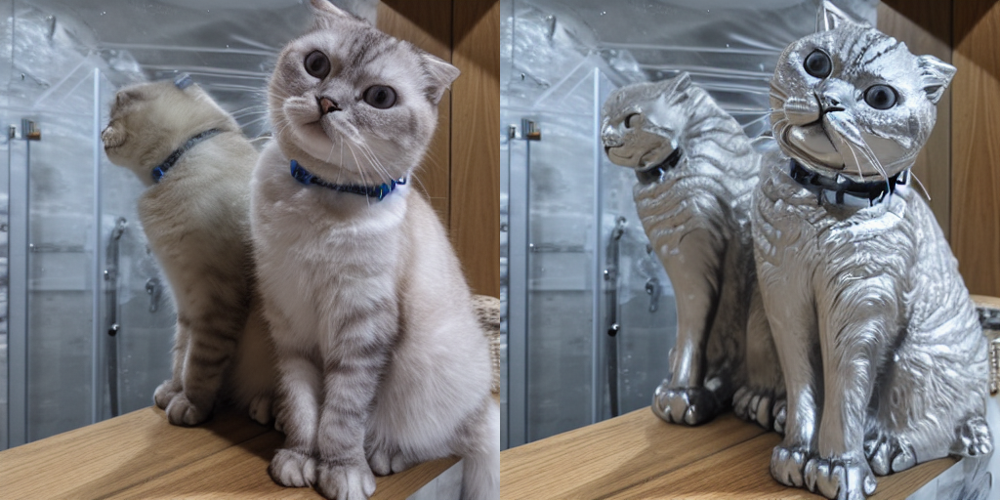
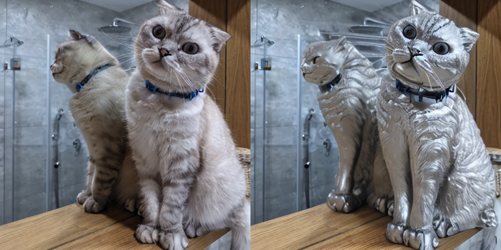
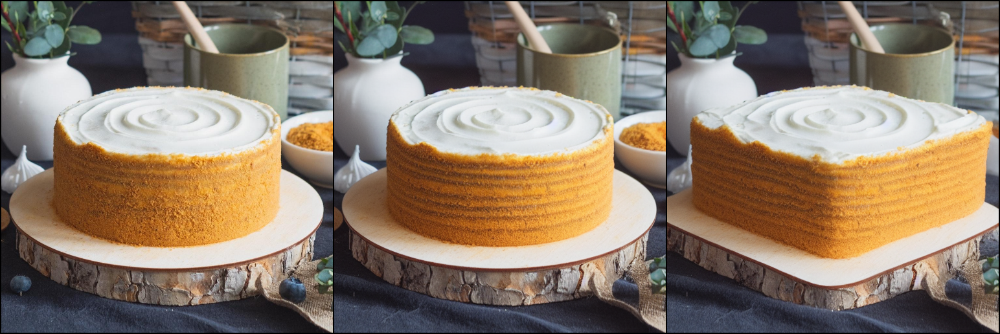

# Improving Tuning-Free Real Image Editing via Proximal Guidance

The code is heavily based on the [Prompt-to-Prompt](https://arxiv.org/abs/2208.01626), [Null-Text Inversion](https://arxiv.org/abs/2211.09794) [**[codebase]**](https://github.com/google/prompt-to-prompt) and on the [MasaCtrl](https://arxiv.org/abs/2304.08465) [**[codebase]**](https://github.com/TencentARC/MasaCtrl).

Input images can be downloaded through [this link](https://drive.google.com/file/d/1iUf2XvKpJlpq_7cWHMTeArHCgeb7qs4u/view?usp=sharing). Most images are from the [StyleDiffusion](https://arxiv.org/abs/2303.15649), [Null-Text Inversion](https://arxiv.org/abs/2211.09794), [Imagic](https://arxiv.org/abs/2210.09276), [MasaCtrl](https://arxiv.org/abs/2304.08465), and [SVDiff](https://arxiv.org/abs/2303.11305) papers.

## Examples
Negative-Prompt Inversion (NPI):
```python
from negative_prompt_inversion import main
main(
    image_path="./images/cat_mirror.png",
    prompt_src="a cat sitting next to a mirror",
    prompt_tar="a silver cat sculpture sitting next to a mirror",
    output_dir="./outputs/npi_real",
    suffix="silver",
    guidance_scale=7.5,
    cross_replace_steps=0.8,
    self_replace_steps=0.6,
    blend_word=((('cat',), ("cat",))),
    eq_params={"words": ("silver", 'sculpture', ), "values": (2,2,)},
    proximal=None,
)
```
NPI reconstructed (left) | NPI edited (right):
<br>

<br>

To run ProxNPI:
```python
from negative_prompt_inversion import main
main(
    image_path="./images/cat_mirror.png",
    prompt_src="a cat sitting next to a mirror",
    prompt_tar="a silver cat sculpture sitting next to a mirror",
    output_dir="./outputs/npi_real",
    suffix="silver",
    guidance_scale=7.5,
    cross_replace_steps=0.8,
    self_replace_steps=0.6,
    blend_word=((('cat',), ("cat",))),
    eq_params={"words": ("silver", 'sculpture', ), "values": (2,2,)},
    proximal='l0',
    quantile=0.7,
    use_inversion_guidance=True,
    recon_lr=1,
    recon_t=400,
)
```
Reconstructed (left) | Edited (right):
<br>

<br>


To run MasaCtrl:
```python
from prox_masactrl import main
main(
    out_dir="./outputs/masactrl_real/",
    source_image_path="./images/cake2.png",
    source_prompt="a round cake",
    target_prompt="a square cake",
    npi=False,
    npi_interp=0,
)
```
Input image (left) | Reconstructed (middle) | Edited (right):
<br>

<br>

To run ProxMasaCtrl:
```python
from prox_masactrl import main
main(
    out_dir="./outputs/masactrl_real/",
    source_image_path="./images/cake2.png",
    source_prompt="a round cake",
    target_prompt="a square cake",
    npi=True,
    npi_interp=1,
    prox='l0',
    quantile=0.6,
)
```
Input image (left) | Reconstructed (middle) | Edited (right):
<br>

<br>

Please see `run_npi.py` and `run_masa.py` for examples.

## Citation
```bibtex
@article{han2023improving,
  title={Improving Negative-Prompt Inversion via Proximal Guidance},
  author={Han, Ligong and Wen, Song and Chen, Qi and Zhang, Zhixing and Song, Kunpeng and Ren, Mengwei and Gao, Ruijiang and Chen, Yuxiao and Liu, Di and Zhangli, Qilong and others},
  journal={arXiv preprint arXiv:2306.05414},
  year={2023}
}
```

```bibtex
@article{miyake2023negative,
  title={Negative-prompt Inversion: Fast Image Inversion for Editing with Text-guided Diffusion Models},
  author={Miyake, Daiki and Iohara, Akihiro and Saito, Yu and Tanaka, Toshiyuki},
  journal={arXiv preprint arXiv:2305.16807},
  year={2023}
}
```

```bibtex
@inproceedings{mokady2023null,
  title={Null-text inversion for editing real images using guided diffusion models},
  author={Mokady, Ron and Hertz, Amir and Aberman, Kfir and Pritch, Yael and Cohen-Or, Daniel},
  booktitle={Proceedings of the IEEE/CVF Conference on Computer Vision and Pattern Recognition},
  pages={6038--6047},
  year={2023}
}
```

```bibtex
@article{hertz2022prompt,
  title={Prompt-to-prompt image editing with cross attention control},
  author={Hertz, Amir and Mokady, Ron and Tenenbaum, Jay and Aberman, Kfir and Pritch, Yael and Cohen-Or, Daniel},
  journal={arXiv preprint arXiv:2208.01626},
  year={2022}
}
```

```bibtex
@article{cao2023masactrl,
  title={MasaCtrl: Tuning-Free Mutual Self-Attention Control for Consistent Image Synthesis and Editing},
  author={Cao, Mingdeng and Wang, Xintao and Qi, Zhongang and Shan, Ying and Qie, Xiaohu and Zheng, Yinqiang},
  journal={arXiv preprint arXiv:2304.08465},
  year={2023}
}
```

```bibtex
@article{song2020denoising,
  title={Denoising diffusion implicit models},
  author={Song, Jiaming and Meng, Chenlin and Ermon, Stefano},
  journal={arXiv preprint arXiv:2010.02502},
  year={2020}
}
```
